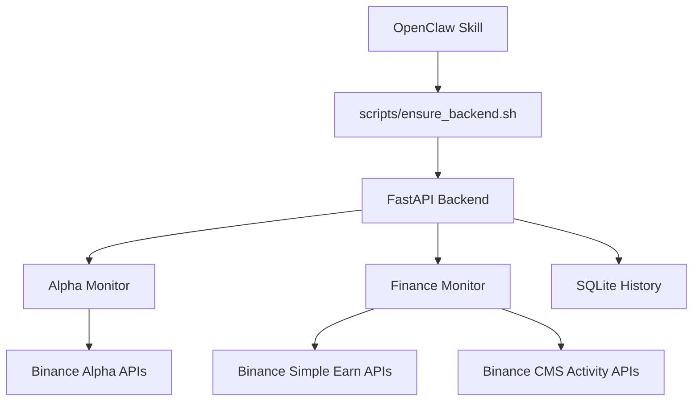

# 🚀 Binance Alpha & Finance Skill for OpenClaw

<p align="center">
  
</p>

<p align="center">
  <a href="./LICENSE"></a>
  <a href="./backend/requirements.txt"></a>
  <a href="./backend/main.py"></a>
  <a href="./SKILL.md"></a>
  <a href="https://github.com/fadai216/binance-alpha-finance-skill/stargazers"></a>
</p>

---

**Binance Alpha & Finance Skill** 是一个专为 [OpenClaw](https://github.com/openclaw/openclaw) AI Agent 框架设计的自托管插件。它能够自动化监控币安（Binance）的高收益机会、理财产品及 Alpha 积分代币，并提供智能投资建议。

[📖 中文教程 (Tutorial)](./docs/TUTORIAL.zh-CN.md) | [🤖 AI 提示词 (Prompts)](./docs/OPENCLAW_PROMPTS.zh-CN.md) | [🆕 更新日志 (Changelog)](./CHANGELOG.md)

---

## 🌟 核心功能 (What's Inside)

### 📊 Alpha 模块 (Alpha Token Stability)
实时监控币安 **Alpha 4x 积分代币**，每分钟自动刷新：
- **波动率分析**：计算 Volatility 与 Spread。
- **风险评分**：提供 `risk_score` 与 `risk_label`（保守/平衡/激进）。
- **趋势追踪**：追踪 Alpha 代币的稳定性趋势，识别异常变动。

### 💰 理财模块 (Binance Finance & Activity)
全方位抓取币安理财（Simple Earn）产品与活动公告：
- **智能排序**：支持按 APR、期限或稳定性排序。
- **活动评估**：对公告活动进行参与价值评分（Participation Scoring）。
- **低门槛筛选**：自动识别适合小额资金、无区域限制的高收益机会。

### 🤖 智能副驾驶 (Copilot Summary)
聚合全量数据，生成结构化的投资摘要：
- **策略适配**：根据用户偏好（保守/平衡/激进）定制建议。
- **多维度汇总**：整合 Alpha 机会、理财推荐与热门活动。

---

## 🛠️ 快速开始 (Quick Start)

### 1. 安装 (Install)
将技能直接克隆到 OpenClaw 的技能目录：

```bash
git clone https://github.com/fadai216/binance-alpha-finance-skill.git ~/.openclaw/skills/binance-alpha-finance
```

### 2. 初始化 (Initialize)
运行一键安装脚本，它将自动创建虚拟环境并安装所有依赖：

```bash
bash ~/.openclaw/skills/binance-alpha-finance/scripts/ensure_backend.sh
```

### 3. 配置 (Config)
*(可选)* 如果需要访问完整的 Simple Earn 产品池，请配置币安 API Key：

```bash
export BINANCE_API_KEY="your_api_key"
export BINANCE_API_SECRET="your_api_secret"
```

---

## 🖥️ 常用指令 (Common Commands)

你可以直接通过命令行与后端交互，或让 OpenClaw 帮你执行：

| 模块 | 指令示例 | 描述 |
| :--- | :--- | :--- |
| **Alpha** | `bash query.sh alpha 'top=3'` | 获取当前最值得关注的 Alpha 代币 |
| **Finance** | `bash query.sh finance 'sort_by=apr&limit=5'` | 按年化收益率排序理财产品 |
| **Activity** | `bash query.sh activity 'status=active&low_barrier_only=true'` | 筛选低门槛、高收益活动 |
| **Copilot** | `bash query.sh summary 'style=balanced'` | 生成平衡型投资策略摘要 |

> **提示**: 使用 `python scripts/query.py --pretty` 可获得格式化美观的输出。

---

## 🏗️ 架构概览 (Architecture)

<details>
<summary>点击展开架构图 (Mermaid Diagram)</summary>


</details>

---

## 📂 项目结构 (Repository Layout)

```text
binance-alpha-finance-skill/
├── backend/          # FastAPI 后端核心逻辑
├── docs/             # 详细教程与更新日志
├── examples/         # API 返回示例 (JSON)
├── scripts/          # 自动化部署与查询脚本
├── SKILL.md          # OpenClaw 技能定义
└── config.json       # 服务配置 (Port, URL等)
```

---

## 🔒 安全说明 (Security & Notes)

- **API 安全**：请确保 `.env` 或环境变量中的 API Key 不被泄露。本项目不会向除币安官方外的任何地方发送你的密钥。
- **自托管**：所有数据快照（SQLite）均存储在本地 `backend/data` 目录下。
- **环境要求**：推荐使用 Python 3.11+ 以获得最佳性能。

---

## 🤝 贡献与致谢

欢迎提交 Issue 或 Pull Request 来完善这个技能！

- **Author**: [fadai216](https://github.com/fadai216)
- **Framework**: [OpenClaw](https://github.com/openclaw/openclaw)

---
<p align="center">
  如果这个项目对你有帮助，欢迎点个 ⭐️ 支持一下！
</p>
