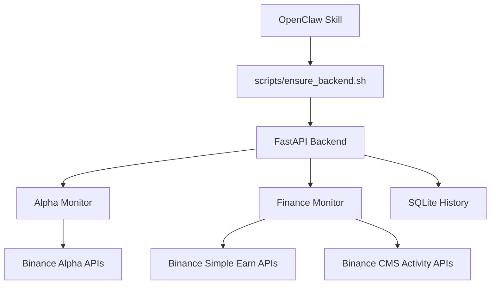

<div align="center">

# 🚀 Binance Alpha & Finance Skill
### 为智能交易而生：您的全能币安理财与 Alpha 监控副驾驶

<p align="center">
  
</p>

[](./LICENSE)
[](./backend/requirements.txt)
[](./backend/main.py)
[](./SKILL.md)
[](https://github.com/fadai216/binance-alpha-finance-skill/stargazers)

**[OpenClaw](https://github.com/openclaw/openclaw) 官方自托管技能插件**
<br>
*自动化监控币安高收益机会、Alpha 积分代币稳定性，并为您量身打造投资建议。*

[📖 保姆级教程](./docs/TUTORIAL.zh-CN.md) • [🤖 AI 提示词](./docs/OPENCLAW_PROMPTS.zh-CN.md) • [📈 核心算法说明](./docs/ALGORITHM.md) • [🆕 更新日志](./CHANGELOG.md)

</div>

---

## ✨ 核心模块 (Core Modules)

| 📊 Alpha 稳定性监控 | 💰 理财与活动抓取 | 🤖 Copilot 投资建议 |
| :--- | :--- | :--- |
| **实时追踪 4x 积分代币** | **全量 Simple Earn 数据** | **智能总结今日机会** |
| 🔹 波动率与价差分析 | 🔹 自动化 APR 排序 | 🔹 保守/平衡/激进风格 |
| 🔹 风险等级 (Risk Label) | 🔹 低门槛活动智能筛选 | 🔹 聚合 Alpha 与理财趋势 |
| 🔹 历史快照与风险预警 | 🔹 基于 ID 的精准追踪 | 🔹 AI 原生数据结构支持 |

---

## 📸 运行预览 (Preview)

| Alpha 稳定性分析 | 理财产品推荐 |
| :---: | :---: |
|  |  |
| **实时监控 Alpha 代币风险** | **一键筛选高收益理财活动** |

---

## 🛠️ 快速部署 (Quick Start)

> [!TIP]
> 本技能设计为**自托管**模式，所有数据存储在本地，确保您的 API 安全与隐私。

### 1. 安装 OpenClaw 本体
本技能需要作为 [OpenClaw](https://github.com/openclaw/openclaw) 的插件运行。如果您尚未安装本体，请先参考其官方文档。

### 2. 一键安装技能
在您的终端中执行以下命令：

```bash
# 克隆到 OpenClaw 技能目录并初始化
git clone https://github.com/fadai216/binance-alpha-finance-skill.git ~/.openclaw/skills/binance-alpha-finance
bash ~/.openclaw/skills/binance-alpha-finance/scripts/ensure_backend.sh
```

---

## ⚙️ 运维与可靠性 (Enterprise Grade)

- 🛡️ **稳定性增强**：内置请求重试与指数退避 (Exponential Backoff) 重试机制。
- 🌐 **代理支持**：支持全局 HTTP 代理配置，告警网络连接难题。
- 🧹 **自动清理**：内置定期历史数据清理脚本，保持系统轻量。
- 📊 **状态看板**：通过 `http://127.0.0.1:8000/dashboard` 实时监控服务健康度。

---

## 🛣️ 路线图 (Roadmap)

- [x] **v1.0** - 基础架构：Alpha 监控与理财抓取。
- [x] **v1.1** - 算法升级：Alpha 风险评分与活动参与评估。
- [x] **v1.4** - 稳定性增强：支持代理、自动重试与本地 Dashboard。
- [ ] **v1.5** - **智能预警**：支持 Telegram / Discord 推送高收益机会。
- [ ] **v2.0** - **全平台支持**：集成 OKX, Bybit 等理财模块。

---

## 🏗️ 架构设计 (Architecture)

<details>
<summary>点击展开技术架构图</summary>


</details>

---

## 📂 项目结构 (Layout)

```text
binance-alpha-finance-skill/
├── backend/          # FastAPI 后端核心逻辑
├── docs/             # 教程、算法与 API 说明
├── examples/         # JSON 返回示例
├── scripts/          # 自动化运维脚本
├── tests/            # 自动化接口测试
└── config.json       # 全局服务配置
```

---

## 🤝 贡献与支持

<p align="center">
  <a href="https://star-history.com/#fadai216/binance-alpha-finance-skill&Date">
    
  </a>
</p>

<div align="center">
  如果这个项目对您有帮助，欢迎点个 ⭐️ 支持一下！<br>
  <b>Author</b>: <a href="https://github.com/fadai216">fadai216</a> | <b>Framework</b>: <a href="https://github.com/openclaw/openclaw">OpenClaw</a>
</div>
