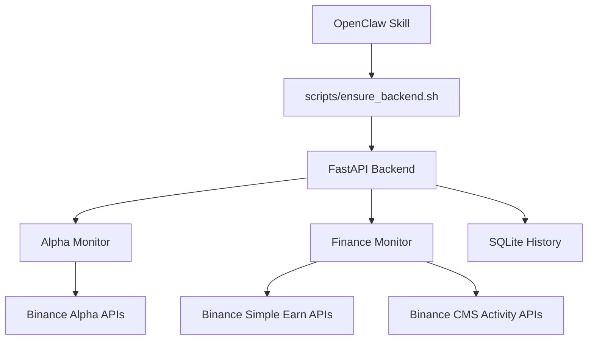

# 🚀 Binance Alpha & Finance Skill for OpenClaw

<p align="center">
  
</p>

<p align="center">
  <a href="./LICENSE"></a>
  <a href="./backend/requirements.txt"></a>
  <a href="./backend/main.py"></a>
  <a href="./SKILL.md"></a>
  <a href="https://github.com/fadai216/binance-alpha-finance-skill/stargazers"></a>
</p>

---

**Binance Alpha & Finance Skill** 是一个专为 [OpenClaw](https://github.com/openclaw/openclaw) AI Agent 框架设计的自托管插件。它能够自动化监控币安（Binance）的高收益机会、理财产品及 Alpha 积分代币，并提供智能投资建议。

[📖 中文保姆级教程 (Tutorial)](./docs/TUTORIAL.zh-CN.md) | [🤖 AI 提示词 (Prompts)](./docs/OPENCLAW_PROMPTS.zh-CN.md) | [🆕 更新日志 (Changelog)](./CHANGELOG.md)

---

## 🌟 核心功能 (What's Inside)

### 📊 Alpha 模块 (Alpha Token Stability)
实时监控币安 **Alpha 4x 积分代币**，每分钟自动刷新：
- **波动率分析**：计算 Volatility 与 Spread。
- **风险评分**：提供 `risk_score` 与 `risk_label`（保守/平衡/激进）。
- **趋势追踪**：追踪 Alpha 代币的稳定性趋势，识别异常变动。

### 💰 理财模块 (Binance Finance & Activity)
全方位抓取币安理财（Simple Earn）产品与活动公告：
- **智能排序**：支持按 APR、期限或稳定性排序。
- **活动评估**：对公告活动进行参与价值评分（Participation Scoring）。
- **低门槛筛选**：自动识别适合小额资金、无区域限制的高收益机会。

---

## 🛠️ 快速开始 (Quick Start)

### 1. 准备工作 (Checklist)
在开始之前，请确保你的电脑已安装以下工具：
- **Python 3.11+** ([下载地址](https://www.python.org/downloads/))
- **Git** ([下载地址](https://git-scm.com/downloads))

### 2. 安装 (Install)
打开终端（Mac/Linux 使用 Terminal，Windows 使用 PowerShell），执行：

```bash
git clone https://github.com/fadai216/binance-alpha-finance-skill.git ~/.openclaw/skills/binance-alpha-finance
```

### 3. 一键初始化 (Initialize)
进入目录并运行脚本，它会自动搞定环境和依赖：

```bash
bash ~/.openclaw/skills/binance-alpha-finance/scripts/ensure_backend.sh
```
> **看到 `Backend is healthy` 字样即表示启动成功！**

---

## 🖥️ 常用指令 (Common Commands)

| 模块 | 指令示例 | 描述 |
| :--- | :--- | :--- |
| **Alpha** | `bash query.sh alpha 'top=3'` | 获取当前最稳的 3 个 Alpha 代币 |
| **Finance** | `bash query.sh finance 'sort_by=apr&limit=5'` | 找 APR 最高的 5 个理财产品 |
| **Copilot** | `bash query.sh summary 'style=balanced'` | 生成一份平衡型的投资建议 |

---

## 🏗️ 架构概览 (Architecture)

<details>
<summary>点击展开架构图 (Mermaid Diagram)</summary>


</details>

---

## 🔒 安全说明 (Security & Notes)

- **API 安全**：配置 API Key 后请务必妥善保管。本项目仅在本地运行，不会上传密钥。
- **自托管**：所有理财和 Alpha 数据快照均存储在本地 `backend/data` 目录下，不依赖云端。

---

## 🤝 贡献与致谢

欢迎提交 Issue 或 Pull Request 来完善这个技能！

- **Author**: [fadai216](https://github.com/fadai216)
- **Framework**: [OpenClaw](https://github.com/openclaw/openclaw)

---
<p align="center">
  如果这个项目对你有帮助，欢迎点个 ⭐️ 支持一下！
</p>
