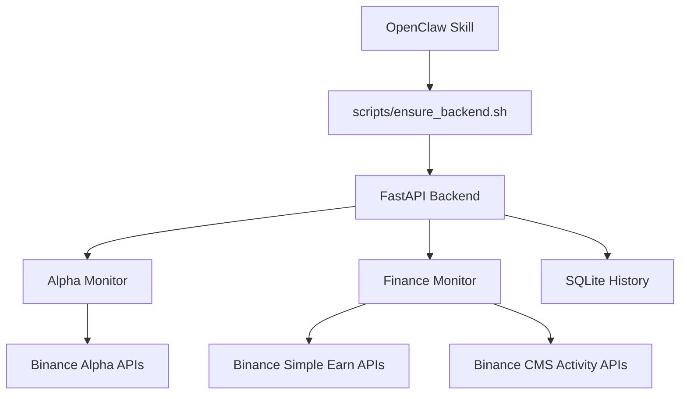

# binance-alpha-finance-skill

[](./LICENSE)
[](./backend/requirements.txt)
[](./backend/main.py)
[](./SKILL.md)

Self-hosted OpenClaw skill for:

- Binance Alpha 4x points token stability analysis
- Binance finance product discovery
- Binance activity discovery
- finance history snapshots
- `product_id` based finance history queries

This repository is designed to be cloned directly into `~/.openclaw/skills/` and used locally.

中文教程见：

- [docs/TUTORIAL.zh-CN.md](./docs/TUTORIAL.zh-CN.md)

## What This Skill Does

### Alpha Module

- discovers current Binance Alpha `mulPoint = 4` tokens
- refreshes every minute
- computes:
  - volatility
  - spread
  - score
- returns alerts:
  - new token alerts
  - high volatility alerts
- adds direct risk ranking fields:
  - `risk_score`
  - `risk_label`
  - `abnormal_flag`
  - `risk_reason`
- adds trend API:
  - `/alpha/stability/trends`

### Finance Module

- fetches Binance finance products
- fetches Binance activity announcements
- supports:
  - APR sorting
  - term sorting
  - activity filtering
  - history snapshots
  - `product_id` based history lookup
  - activity participation scoring
  - low-barrier activity filtering
  - finance product recommendation scoring

### Copilot Summary

- aggregates:
  - Alpha stability and risk trends
  - finance recommendations
  - scored activities
- provides:
  - `/binance/copilot/summary`
  - `style=conservative|balanced|aggressive`

### Data Source Strategy

- `signed-sapi`
  - official Binance Simple Earn signed API
- `activity-derived`
  - finance products derived from official Binance activity announcements
- `public-finance-fallback`
  - fallback/public path when official public finance endpoints are blocked or unavailable

## Architecture



## Repository Layout

```text
binance-alpha-finance-skill/
├── SKILL.md
├── README.md
├── LICENSE
├── config.json
├── apis.json
├── docs/
│   ├── RELEASE_NOTES_v1.0.0.md
│   ├── RELEASE_NOTES_v1.1.0.md
│   ├── RELEASE_NOTES_v1.1.1.md
│   └── TUTORIAL.zh-CN.md
├── backend/
│   ├── alpha_monitor/
│   ├── finance_monitor/
│   ├── data/
│   ├── API.md
│   ├── main.py
│   ├── requirements.txt
│   └── scheduler.py
└── scripts/
    ├── ensure_backend.sh
    ├── install.sh
    ├── query.py
    ├── query.sh
    ├── start_api.sh
    └── start_scheduler.sh
```

## Install

### Option A: clone directly into OpenClaw skills

```bash
git clone https://github.com/fadai216/binance-alpha-finance-skill.git ~/.openclaw/skills/binance-alpha-finance
```

Then run:

```bash
bash ~/.openclaw/skills/binance-alpha-finance/scripts/ensure_backend.sh
```

### Option B: clone anywhere, then install into OpenClaw

```bash
git clone https://github.com/fadai216/binance-alpha-finance-skill.git
cd binance-alpha-finance-skill
bash scripts/install.sh
```

## First Run

```bash
bash ~/.openclaw/skills/binance-alpha-finance/scripts/ensure_backend.sh
```

This will:

1. create `backend/.venv/`
2. install dependencies from `backend/requirements.txt`
3. start FastAPI on `127.0.0.1:8000`
4. reuse an existing healthy backend if one is already listening on the configured port

## Common Commands

### Alpha

```bash
bash ~/.openclaw/skills/binance-alpha-finance/scripts/query.sh alpha 'top=3'
bash ~/.openclaw/skills/binance-alpha-finance/scripts/query.sh alpha-history 'limit=12'
bash ~/.openclaw/skills/binance-alpha-finance/scripts/query.sh alpha-history 'limit=6'
bash ~/.openclaw/skills/binance-alpha-finance/scripts/query.sh alpha 'top=6'
```

### Finance

```bash
bash ~/.openclaw/skills/binance-alpha-finance/scripts/query.sh finance 'sort_by=apr&order=desc&product_type=all&limit=5'
bash ~/.openclaw/skills/binance-alpha-finance/scripts/query.sh finance 'sort_by=stability&order=desc&redeemable_only=true&limit=5'
bash ~/.openclaw/skills/binance-alpha-finance/scripts/query.sh activity 'status=active&reward_type=all&limit=5'
bash ~/.openclaw/skills/binance-alpha-finance/scripts/query.sh activity 'status=active&reward_type=all&low_barrier_only=true&max_capital=500&limit=5'
bash ~/.openclaw/skills/binance-alpha-finance/scripts/query.sh finance-history 'product_id=activity:65317d61d1c445f99f73a04c05233dd2&limit=5'
```

### New Scored / Summary Endpoints

```bash
curl 'http://127.0.0.1:8000/binance/finance/activity/scored?limit=3'
curl 'http://127.0.0.1:8000/binance/finance/recommend?sort_by=stability&limit=3'
curl 'http://127.0.0.1:8000/alpha/stability/ranked?top=3'
curl 'http://127.0.0.1:8000/alpha/stability/trends?limit=6'
curl 'http://127.0.0.1:8000/binance/copilot/summary?style=balanced'
```

### Manual Backend Control

```bash
bash ~/.openclaw/skills/binance-alpha-finance/scripts/start_api.sh
bash ~/.openclaw/skills/binance-alpha-finance/scripts/start_scheduler.sh
```

## API Examples

### `/binance/finance`

```json
{
  "items": [
    {
      "product_id": "activity:65317d61d1c445f99f73a04c05233dd2",
      "product_name": "Enjoy Up to 8% APR with RLUSD Flexible Products",
      "product_type": "activity",
      "asset": "RLUSD",
      "apr": 8.0,
      "term_days": 0,
      "min_purchase_amount": null,
      "available_balance": "10,000 RLUSD",
      "reward_label": "Users who subscribe to RLUSD Flexible Products may enjoy up to 8% APR.",
      "reward_type": "apr",
      "source": "activity-derived"
    }
  ],
  "updated_at": "2026-03-14T06:56:46.828619+00:00",
  "source": "public-finance-fallback+cms-activities+activity-derived-products",
  "total": 1
}
```

### `/binance/finance/history`

```json
[
  {
    "timestamp": "2026-03-14T06:56:46.828619+00:00",
    "products": [
      {
        "product_id": "activity:65317d61d1c445f99f73a04c05233dd2",
        "product_name": "Enjoy Up to 8% APR with RLUSD Flexible Products",
        "product_type": "activity",
        "asset": "RLUSD",
        "apr": 8.0,
        "term_days": 0,
        "source": "activity-derived"
      }
    ],
    "activities": []
  }
]
```

### `/binance/finance/activity/scored`

Returns structured scoring fields:

- `score`
- `score_label`
- `reasons`
- `participation_difficulty`
- `time_urgency`
- `complexity_score`
- `requires_kyc`
- `requires_holding`
- `requires_region_eligibility`
- `requires_trading_volume`
- `restriction_flags`
- `low_barrier`

### `/binance/finance/recommend`

Supports:

- `min_apr`
- `max_term`
- `redeemable_only`
- `source`
- `product_type`
- `sort_by=apr|term|stability|recommendation`

Additional output fields:

- `recommendation_score`
- `recommendation_reason`
- `risk_hint`
- `redeemable`

### `/alpha/stability/ranked`

Adds:

- `most_stable`
- `most_risky`
- `abnormal_symbols`

### `/alpha/stability/trends`

Returns per-symbol trend analysis:

- `risk_delta`
- `score_delta`
- `volatility_delta`
- `spread_delta`
- `trend_label`
- `trend_reason`
- `top_worsening`
- `top_improving`

### `/binance/copilot/summary`

Returns:

- `top_alpha_opportunity`
- `top_finance_opportunity`
- `top_activity_opportunity`
- `alpha_risk_trends`
- `overall_highlights`
- `summary_text`

## Optional Binance API Credentials

If you want the full official Simple Earn product pool instead of fallback/public-derived data, configure:

```bash
export BINANCE_API_KEY="..."
export BINANCE_API_SECRET="..."
```

Then restart the backend.

## Config

Edit `config.json` if needed:

- `apiBaseUrl`
- `apiHost`
- `apiPort`
- `backendRoot`
- `venvDir`

Default local API:

- `http://127.0.0.1:8000`

## Notes

- If port `8000` is occupied but `/health` returns successfully, `ensure_backend.sh` treats the backend as healthy.
- This repository is backend-only. No frontend is required for skill usage.
- Runtime files, local caches, sqlite snapshots, and `.venv/` are ignored by `.gitignore`.
- For detailed local API behavior, see [backend/API.md](./backend/API.md).
